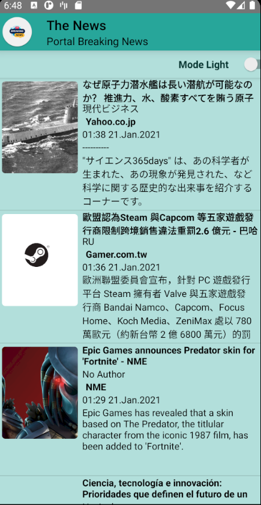

# News

The News Android App Developed in DSM-2-2020
Assignament for Desarrollo de Soluciones Móviles. 

# The-News
> News App using newsApi

## Table of contents
* [General info](#general-info)
* [Screenshots](#screenshots)
* [Features](#features)
* [Technologies](#technologies)
* [Status](#status)
* [Contact](#contact)

## General info
Project created with the purpose of learn how to create a android app, using an API ( ApiRest,NewsApi)
and practice our codding skills.

## Screenshots

## Features
Night Mode 🌗

## Technologies
-JAVA 8 
-Gradle 
-Laravel 
-Php 8.0 

## Status
Project is: _in progress_.

## Contact
Created by [@ChristopherRojas](https://github.com/ChristopherRojas) and [@KamiloBarrera](https://github.com/KamiloBarrera) - feel free to contact me!